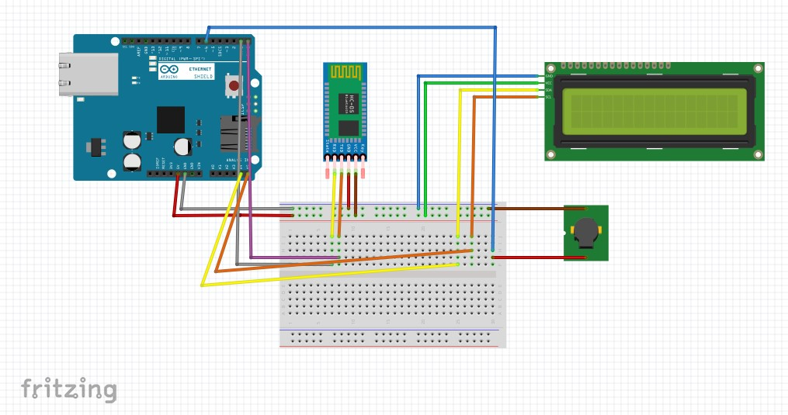
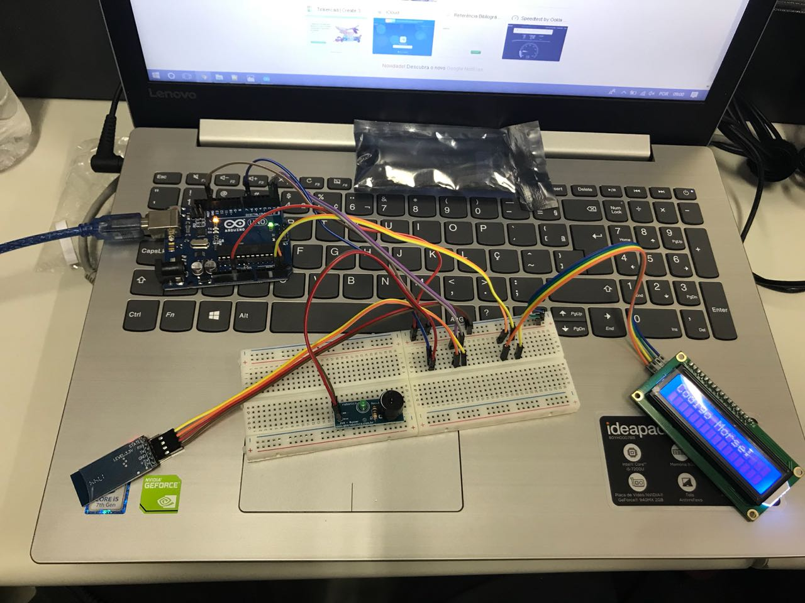

# Codigo-Morse

## Descrição:

Esse projeto tem como objetivo transformar alguma palavra digitada pelo usuário para código Morse. Para digitar as palavras que seram transcritas, o usuário deve baixar o aplicativo "Bluetooth Serial", disponivel na Play Store. Com o aplicativo, ele conecta o bluetooth do celular com o do módulo acoplado no Arduino. Quando alguma palavra e enviada através do celular, a partir do código feito, ela será mostrada pelo Display no LCD em código Morse instantaneamente, letra por letra. A cada letra mostrada o Buzzer reproduz um som para ponto e outro para traço (Código Morse), assim permitindo que o usuário tenha uma idéia de como o código funciona.

## Componentes necessários:

*	Arduino Uno R3
*	Módulo bluetooth HC-05
*	Módulo Buzzer
*	Display LCD com módulo I2C
*	Protoboard 740 pontos
*	10 Fios jumper (Macho-Macho) (Opcionais)
* 10 cabos jumper (Fêmea-Macho)

## Instalação:

* A primeira coisa a fazer é baixar e instalar o Arduino IDE, para poder executar os programas no arduino, e baixar também a biblioteca LiquidCrystal_I2C, para poder manusear o display LCD.
* Instalação dos módulos:
  * Módulo Bluetooth HC-05: Pegue quatro jumpers (Fêmea_Macho) e conecte a parte fêmea nos pinos do módulo. Pegue os cabos                conectados nos pinos GND e VCC (5V), e conecte na parte negativa e positiva da protoboard, respectivamente. Após os esses dois        jumpers conectados, sobraram o RX, receptor, e o TX, transmissor. Pegue o jumper que esta conectado no pino RX do módulo e conecte    na entrada TX do Arduino, e o jumper TX conecte na entrada RX do Arduino. 
  * Display LCD: Pegue quatro jumpers (Fêmer-Macho) e conecte a parte fêmea nos quatro pinos centrais do módulo LCD. O pino GND e o       pino VCC devem ser conectados nas partes negativas e positivas, respectivamente. Os outros dois pinos, SDA e SCL, serão conectados     nas   portas analógicas do Arduino, neste caso A4 e A5, respectivamente.
  * Módulo Buzzer: O Buzzer tem apenas dois pinos de saída, que são GND e Sinal. O GND será conectado por um jumper (Fêmea-Macho)         na parte negativa da protoboard e o Sinal será conectado na entrada 6 do Arduino.
* Depois de tudo conectado no Arduino, abra o Arduino IDE e conecte o Arduino pelo cabo USB do computador. Após conectado, copie o código que está disponível no final deste arquivo, e cole na área de código do Arduino IDE. Depois de ter feito esses passos, clique no botão "Verificar" e quando acaba a verificação, clique no botão "Carregar", e assim então o Arduino receberá o código colocado no programa.

## Esquemas: 

### Esquema montado no programa "Fritzing":



### Esquema físico:




## Código:

```C
#include <Wire.h>
#include <LiquidCrystal_I2C.h>

//Pino ligado ao buzzer
int buzzer = 6;
//String
char letra;
//Display no endereco 0x27
LiquidCrystal_I2C lcd(0x27,2,1,0,4,5,6,7,3, POSITIVE);
 
void setup()
{
 Serial.begin(9600);
 //Define o pino do Buzzer como Saida 
 pinMode(buzzer,OUTPUT);  
 //Define o tamanho do LCD
 lcd.begin (16,2);
 //Liga a luz do LCD
 lcd.setBacklight(HIGH);
 //Setar o cursor na coluna 0 e linha 0
  lcd.setCursor(0, 0);
  //Fixa essa mensagem
  lcd.print("Codigo Morse:");
}
 
void loop()
{ 
  //Setar o cursor na coluna 0 e linha 1
  lcd.setCursor(0, 1);
  //Verifica se tem letras no Serial
  if(Serial.available())
  {
    letra = Serial.read();
            
    if(letra == ' ')
    {
      //Imprime no LCD
      lcd.print("NONE"); 
      delay(1000);
    }
    else if(letra == 'a')
    {
      bus_ponto();
      delay(1000);
      bus_linha();
      delay(500);
      lcd.print("      A");
      delay(3000);      
    }
    else if(letra == 'b')
    {
      bus_linha();
      delay(1000);
      bus_ponto();
      delay(1000);
      bus_ponto();
      delay(1000);
      bus_ponto();
      delay(500);
      lcd.print("    B");
      delay(3000);
    }
    else if(letra == 'c')
    {
      bus_linha();
      delay(1000);
      bus_ponto();
      delay(1000);
      bus_linha();
      delay(1000);
      bus_ponto();
      delay(500);
      lcd.print("    C");
      delay(3000);
    }
    else if(letra == 'd')
    {
      bus_linha();
      delay(1000);
      bus_ponto();
      delay(1000);
      bus_ponto();
      delay(500);
      lcd.print("     D");
      delay(3000);
    }
    else if(letra == 'e')
    {
      bus_ponto();
      delay(500);
      lcd.print("       E");
      delay(3000);
    }
    else if(letra == 'f')
    {
      bus_ponto();
      delay(1000);
      bus_ponto();
      delay(1000);
      bus_linha();
      delay(1000);
      bus_ponto();
      delay(500);
      lcd.print("    F");
      delay(3000);
    }
    else if(letra == 'g')
    {
      bus_linha();
      delay(1000);
      bus_linha();
      delay(1000);
      bus_ponto();
      delay(500);
      lcd.print("     G");
      delay(3000);
    }
    else if(letra == 'h')
    {
      bus_ponto();
      delay(1000);
      bus_ponto();
      delay(1000);
      bus_ponto();
      delay(1000);
      bus_ponto();
      delay(500);
      lcd.print("    H");
      delay(3000);
    }
    else if(letra == 'i')
    {
      bus_ponto();
      delay(1000);
      bus_ponto();
      delay(500);
      lcd.print("      I");
      delay(3000);
    }
    else if(letra == 'j')
    {
      bus_ponto();
      delay(1000);
      bus_linha();
      delay(1000);
      bus_linha();
      delay(1000);
      bus_linha();
      delay(500);
      lcd.print("    J");
      delay(3000);
    }
    else if(letra == 'k')
    {
      bus_linha();
      delay(1000);
      bus_ponto();
      delay(1000);
      bus_linha();
      delay(500);
      lcd.print("     K");
      delay(3000);      
    }
    else if(letra == 'l')
    {
      bus_ponto();
      delay(1000);
      bus_linha();
      delay(1000);
      bus_ponto();
      delay(1000);
      bus_ponto();
      delay(500);
      lcd.print("    L");
      delay(3000);
    }
    else if(letra == 'm')
    {
      bus_linha();
      delay(1000);
      bus_linha();
      delay(500);
      lcd.print("      M");
      delay(3000);
    }
    else if(letra == 'n')
    {
      bus_linha();
      delay(1000);
      bus_ponto();
      delay(500);
      lcd.print("      N");
      delay(3000);
    }
    else if(letra == 'o')
    {
      bus_linha();
      delay(1000);
      bus_linha();
      delay(1000);
      bus_linha();
      delay(500);
      lcd.print("     O");
      delay(3000);
    }
    else if(letra == 'p')
    {
      bus_ponto();
      delay(1000);
      bus_linha();
      delay(1000);
      bus_linha();
      delay(1000);
      bus_ponto();
      delay(500);
      lcd.print("    P");
      delay(3000);
    }
    else if(letra == 'q')
    {
      bus_linha();
      delay(1000);
      bus_linha();
      delay(1000);
      bus_ponto();
      delay(1000);
      bus_linha();
      delay(500);
      lcd.print("    Q");
      delay(3000);
    }
    else if(letra == 'r')
    {
      bus_ponto();
      delay(1000);
      bus_linha();
      delay(1000);
      bus_ponto();
      delay(500);
      lcd.print("     R");
      delay(3000);
    }
    else if(letra == 's')
    {
      bus_ponto();
      delay(1000);
      bus_ponto();
      delay(1000);
      bus_ponto();
      delay(500);
      lcd.print("     S");
      delay(3000);
    }
    else if(letra == 't')
    {
      bus_linha();
      delay(500);
      lcd.print("       T");
      delay(3000);
    }
    else if(letra == 'u')
    {
      bus_ponto();
      delay(1000);
      bus_ponto();
      delay(1000);
      bus_linha();
      delay(500);
      lcd.print("     U");
      delay(3000);
    }
    else if(letra == 'v')
    {
      bus_ponto();
      delay(1000);
      bus_ponto();
      delay(1000);
      bus_ponto();
      delay(1000);
      bus_linha();
      delay(500);
      lcd.print("    V");
      delay(3000);
    }
    else if(letra == 'w')
    {
      bus_ponto();
      delay(1000);
      bus_linha();
      delay(1000);
      bus_linha();
      delay(500);
      lcd.print("     W");
      delay(3000);
    }
    else if(letra == 'x')
    {
      bus_linha();
      delay(1000);
      bus_ponto();
      delay(1000);
      bus_ponto();
      delay(1000);
      bus_linha();
      delay(500);
      lcd.print("    X");
      delay(3000);
    }
    else if(letra == 'y')
    {
      bus_linha();
      delay(1000);
      bus_ponto();
      delay(1000);
      bus_linha();
      delay(1000);
      bus_linha();
      delay(500);
      lcd.print("    Y");
      delay(3000);
    }
    else if(letra == 'z')
    {
      bus_linha();
      delay(1000);
      bus_linha();
      delay(1000);
      bus_ponto();
      delay(1000);
      bus_ponto();
      delay(500);
      lcd.print("    Z");
      delay(3000);
    }

    lcd.setCursor(0,1);
    lcd.print("          ");
  }
  
}

void bus_ponto()
{
    tone(buzzer,100);  //Quanto maior o numero, mais agudo vai ser. Frequencia em Hz
    //Imprime no LCD
    lcd.print("*");  
    //Espera um tempo para Desativar
    delay(100);
    //Desativa o buzzer
    noTone(buzzer); 
}

void bus_linha()
{
    tone(buzzer,1000);  //Quanto maior o numero, mais agudo vai ser. Frequencia em Hz
    //Imprime no LCD
    lcd.print("-"); 
    //Espera um tempo para Desativar
    delay(300);
    //Desativa o buzzer
    noTone(buzzer); 
}
```
